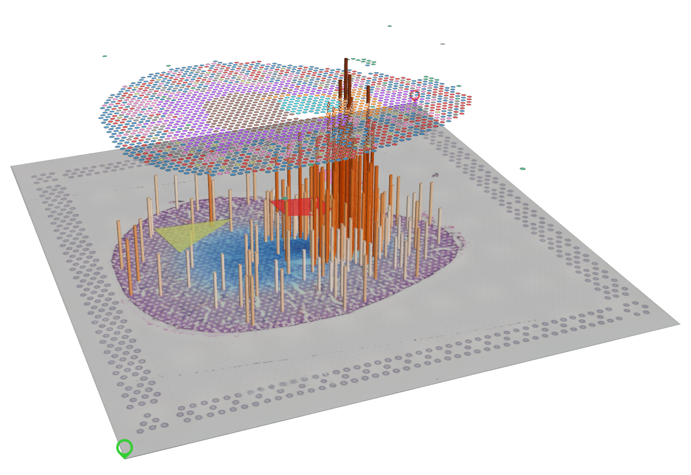

# Spatial-LVV



## Name
A Lightweight & Versatile Visualization Tool for Spatial-Omics Data.

## Description
Spatial-LVV is a lightweight and versatile visualization tool specifically developed for
single cell spatial-omics data analysis, including spatial transcriptiomics and more. Its 3D
integration of multiple layers within a single space makes it highly suitable for
visualizing multi-modal spatial data. Leveraging the rendering capabilities of WebGL2 (GPU)
technology, Spatial-LVV efficiently processes large datasets, offering interactivity,
responsiveness, and a wide range of visualization effects through the stacking of multiple
layers. As the saying goes, a picture is worth a thousand words. We firmly believe that
effective data visualization plays a pivotal role in data exploration and interpretation,
serving as a key component in gaining insights from complex datasets. Spatial-LVV represents
a valuable tool for achieving these objectives.

The development of Spatial-LVV relied on several outstanding third-party libraries, such as
deckgl, vue3, and react framework, alongside numerous other open-source libraries that may
not all be listed here. I am immensely grateful for the contributions of these libraries and
the invaluable work they have provided.

Please visit our [documentation](https://github.com/yezhenqing/spatial-lvv) for installation, tutorials, examples and more.


## Installation & Usage
First, please go to github website to download the spatial-lvv:

```bash
  $ git clone https://github.com/yezhenqing/spatial-lvv
```


There are two ways to start spatial-lvv for different users:

*  regular user 

You may need to install [docker](https://docs.docker.com/engine/install/) on your computer already, then you can run the below command:


```bash
   $ cd spatial-lvv
   $ docker compose -f docker-compose.yml -d up
```

*  development user

If you are a development user, I will assume you already installed [node/npm](https://nodejs.org/en/download) on your computer:


```bash
   $ cd spatial-lvv
   $ npm install
   $ npm run dev
```

After the docker instance or node server started, the spatial-lvv will be ready for exploration. 
You can open your browser to visit the url link: http://localhost:8225/


## License
This repository is under MIT License. 

