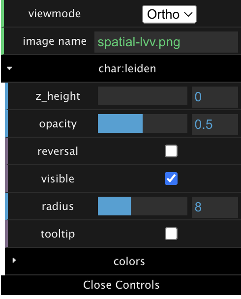

User Guide
==========

A quick demo
------------

Spatial-LVV has a built-in demo for exploration, the user interface is quite intrinsic and straigthforward. 
The left panel mainly control the on/off of the layers for different variables. By toggling it to "on" state, 
the corresponding layer will be added into the visual output. And the "yellow" color of a menu item indicates 
the current active layer.

The middle pane will render the visual output timely and responsively, as long as the setting paramters changed.
It supports several mouse actions, including zoom ( mouse wheel ), rotate (mouse left), and drag ("Ctrl" + mouse left). 
If you are Mac OS user, probably need to replace the "Ctrl" with the "Command" key.

The right-top panel provides a convinience interface for adjusting those parameters to control the apperance
of the current active layer, and organize each layer well for a good layout. Particullaly, You can switch between 
the two view modes, including the 2D orthographic and the 3D orbiting perspective mode.

.. video:: _static/spatial-demo-video.mp4
   :autoplay:
   :loop:
   :height: 500
   :width: 550

|

Variable types and visual layers
--------------------------------

Basically, in spatial-omics data processing, no matter where the data source come from, to spatial-lvv's perspective
view, it can always be divided into four types of variables, namely categorial variable, numerical variable, gene heatmap
variable, and geometric shape variable. Spatiall-LVV will generate the corresponding visual layers for these different 
variables accordingly. We will list them out as below:

*  **Categorial variable -> ScatterplotLayer**

   Each categorial variable will be rendered into a ScatterplotLayer, and each data element will be represented by a 
   small circle dot (spatially-resolved spot) with filled color assignment from its categorial value. The radius of 
   these circle points can be adjusted and corresponded to the spatial resolution of spots.

*  **Numerical variable -> ColumnLayer**

   Each numerical variable can be rendered into a ColumnLayer, and each data element will be represented by a extruded
   cylinder column. The height of each column will be proporsional to the range of numerical values. Similar to the categorial 
   variable in ScatterplotLayer, the radius of cylinder can be adjusted and corresponded to the spatial resolution of spots.

*  **Gene Heatmap variable -> HeatBitmapLayer**

   Gene heatmap is essentially a numerical variable, but we distinguish it from the above numerical variable, mostly because
   of the spatial resolution of spots on the image, namely the gap distance between spots. For example, the "radius" parameter
   in the ScatterplotLayer and ColumnLayer. For gene heatmap variable, spatial-lvv will generate a continuous heatmap layer
   with Gaussian estimation for those spatial gaps based on the gene expression values as weights. We used the Fast Gaussian 
   kernel density estimation (`fast-kde <https://github.com/uwdata/fast-kde>`_) for gene heatmap plotting here. 

*  **Geometric shape variable -> GeoJsonLayer**

   Each geometric shape variable actually is one `GeoJson <https://geojson.org/>`_ file, containing feature collections about 
   various geometric shapes rendered to one GeoJsonLayer.  It is optional for spatial-lvv, but it may be useful when people want
   to add some customized annotation to some region of interest (ROI) on the image, for example cancer-cell enrich regions, or
   cell segmentation.

Input files
-----------

You need to provide some input files to launtch spatial-lvv, and at least two files are mandatorily required.
One is the image file, and the other is CSV file containing properly formatted columns (corresponding to different
types of variables). To make things simplify, we would use the files from the "quickdemo" to illustrate the 
specification of the format for these files.

| quickdemo/output      (please don't put "/output" in your real data)
| ├── kidney_demo.png
| ├── kidney_demo.csv
| ├── json          
| │   └── ROI_kidney.json

* **IMAGE file** (for example: quickdemo/output/kidney_demo.png)

  Currently, spatial-lvv only accepts the PNG file for the input image (other format images can be transformed to PNG 
  easily by many tools), and importantly, this image will define the pixel coordinate space for all data plotting. As 
  an example, please refer to the file "spatial-lvv/quickdemo/output/kidney_demo.png". Only one image file is allowed 
  for one case.

* **CSV file**

  The CSV file is the primary file for spatial-lvv to define those variables and correspoding layers, and there are
  several constraints need to stand by for this file. And only one CSV file is allowed for one case.
  
   Mandatory columns: there are three columns must be presented in the file header.
      "id:spot": the unique id represents the cell/spot entity.

      "pos:pixel_x": the pixel position along X-axis in the image for this entity.

      "pos:pixel_y": the pixel position along Y-axis in the image for this entity. 

   Categorial columns: need to start with "char:", and followed by any variable name.
      "char:leiden": it can be replaced with other categorial variable name for "leiden". 

      "char:phase": it can be replaced with other categorial variable name for "phase". 

   Numerical columns: need to start with "num:", and followed by any variable name.
      "num:Alpl": it can be replaced with other numerical variable name for "Alpl". 
      
      "num:Sprr2a3": it can be replaced with other numerical variable name for "Sprr2a3". 

   Gene-heatmap columns: need to start with "gene:", and followed by any gene name.
      "gene:Cryab": it can be replaced with other gene name for "Cryab".
      
      "gene:Sprr1a": it can be replaced with other gene name for "Sprr1a".  

.. csv-table:: kidney_demo.csv
   :header: "id:spot", "pos:pixel_x", "pos:pixel_y", "char:leiden", "char:phase", "gene:Cryab", "gene:Sprr1a", "num:Alpl", "num:Sprr2a3"
   :widths: 15, 10, 10, 5, 5, 10, 10, 10, 10

   "AAACAAGTATCTCCCA-1", 5, G1, 2.450, 1.293, 2.190, 0.0, 1392, 750
   "AAACACCAATAACTGC-1", 5, G1, 0.0, 1.752, 2.728, 0.0, 421, 569

* **JSON file**

  The JSON file is optional, but it can be useful when we want to annotate some regions of interested (ROI) on the image.
  There are two keys ("id" and "group") in "properties" are must required for each feature. Multiple JSON files are supported, 
  and need to be deposited into the same "json" folder. 

.. code-block:: json

   { "features": [
         { 
           "geometry": {
              "coordinates": [ [ [ 381.96, 760.15 ], [ 343.73, 952.1  ], [ 622.3, 923.95 ] ] ],
              "type": "Polygon" },
           "properties": { "id": "feature-1", "group": "grp-1" },
           "type": "Feature" 
         },
         { 
           "geometry": {
              "coordinates": [ [ [ 803.69, 872.77  ], [ 785.31, 1002.79 ], [ 960.61, 965.38  ], [ 975.25, 866.29  ], [ 921.99, 832.04 ] ] ],
              "type": "Polygon" },
           "properties": { "id": "feature-2", "group": "grp-2" },
           "type": "Feature" 
         },
         { 
           "geometry": {
              "coordinates": [ [ [ 1042.96, 1043.75 ], [ 1012.11, 1189.68 ],  [ 1160.95, 1132.59 ], [ 1153.65, 998.19  ] ] ],
              "type": "Polygon" },
           "properties": { "id": "feature-3", "group": "grp-3" },
           "type": "Feature" 
         },
      ],
      "type": "FeatureCollection"
   }

Concise control interface
-------------------------

Spatial-lvv will provide the concise control interface in the top-right corner,
and the content will dependant on the current active layer. Most of those items
are constant, only few items will changed acoordingly. The below one is an example
from an active ScatterplotLayer, others are similar.

+-------------------+------------------------------------------+
|       |pic1|      | viewmode: 2D ortho, 3D orbit             |
|                   +------------------------------------------+
|                   | the output image name                    |
|                   +------------------------------------------+
|                   | current active layer                     |
|                   +------------------------------------------+
|                   | the layer z-height in 3D oribit          |
|                   +------------------------------------------+
|                   | adjust layer's opacity                   |
|                   +------------------------------------------+
|                   | negative z-height in 3D oribit           |
|                   +------------------------------------------+
|                   | toggle on/off visually, no layer destroy |
|                   +------------------------------------------+
|                   | spot size (scatterlayer and columnlayer) |
|                   +------------------------------------------+
|                   | toggle on/off text annotation            |
|                   +------------------------------------------+
|                   | color schema for the layer               |
|                   +------------------------------------------+
|                   | close this control interface             |
+-------------------+------------------------------------------+

Tooltip and image export
------------------------
It is worth to mention that tooltip will be available for most of layers, except
the Gene-Heatmap layer. You can enable this function by toggling on/off the "tooltip"
button in the control panel. 

And also, after all layers are decided and well-stacked, you can export the final 
visualization to an external image by clicking the button "Export Image".