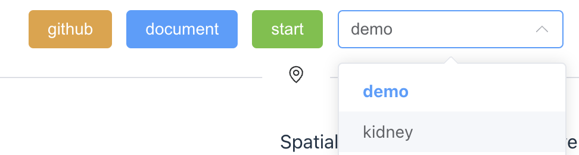

Installation & Usage
====================

Installation
------------

First, please go to github website to download the spatial-lvv:

.. code-block:: console

  $ git clone https://github.com/yezhenqing/spatial-lvv

There are two ways to start spatial-lvv for different users:

*  regular user 

You may need to install `docker <https://docs.docker.com/engine/install/>`_ on your computer already, then you can run the below command:

.. code-block:: console

   $ cd spatial-lvv
   $ docker compose -f docker-compose.yml -d up

*  development user

If you are a development user, I will assume you already installed `node/npm <https://nodejs.org/en/download>`_ on your computer:

.. code-block:: console

   $ cd spatial-lvv
   $ npm install
   $ npm run dev

Usage
-----

After the docker or node server started, the spatial-lvv will be ready for exploration. You can 
open your browser to visit the url link: http://localhost:8225/

.. tip::

   If you feel the page freezed, please refresh the page several times.

Spatial-LVV has provided a built-in demo for exploration, so you can be familiar with the tool quickly.
To start with your own case, you can wrap up your data files into a new clean folder (For example, suppose
we have our own data set -- kidney), and then copy this folder into the proper location. 

If you are using spatial-lvv via docker, copy to spaital-lvv/userdata/:

.. code-block:: console

   $ cp -r /your_paht_to/kidney spatial-lvv/userdata/
   $ docker compose -f docker-compose.yml -d up

If you are using spatial-lvv via node, copy to spatial-lvv/src/data/:

.. code-block:: console

   $ cp -r /your_paht_to/kidney spatial-lvv/src/data/
   $ npm run dev

Now you should be able to see the data set you just added as shown below:

